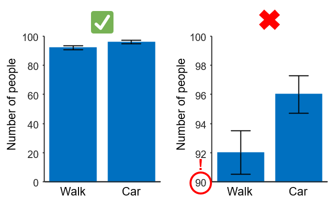
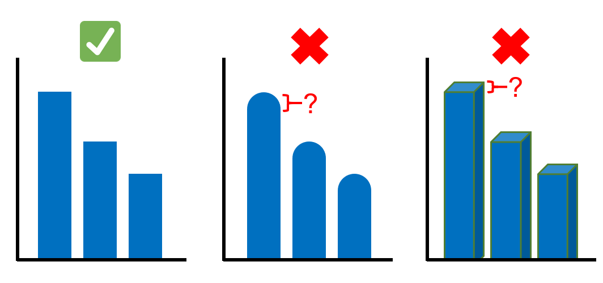
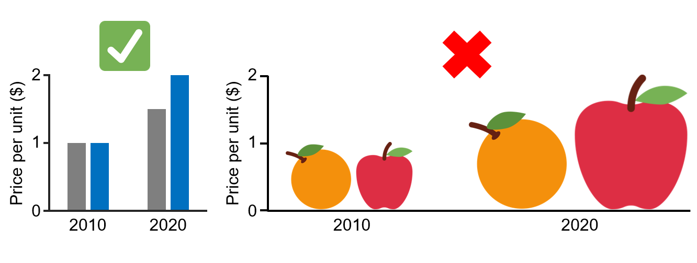

# Bar graph best practices

## 1. Start y-axis at zero

Make sure all your bars are plotted in a graph which y-axis starts at a value of zero. This makes it easier for your readers to get an accurate view of the magnitude of the difference between bars. A bar graph with a non-zero baseline can easily misrepresent the comparison between bars since the ratio in bar lengths will not match the ratio in actual bar values.

<figure>
    
    <figcaption>Comparison of y-axis starting at zero or not</figcaption>
</figure>

## 2. Make your bars rectangular
Avoid using shapes for your bars that are not strictly rectangular (for example, rounded bar caps). When bars are not shaped like rectangles with 90 degree angles, it is difficult for your readers to know the actual value in the y-axis of the bar. Make sure the top of each bar is flat so everyone can easily tell what the value represented is and to be able to compare values between bars.

Additionally, do not use 3-D effects on the bars. This can also make it harder to know the true bar lengths.

<figure>
    
    <figcaption>Examples of different bar shapes</figcaption>
</figure>

---
## Common misuses

### 1. Using images instead of bars
It might be attractive and creative to use images, drawings or illustrations instead of rectangular bars. However, this often results in misrepresented data:
- Most images scale both in width and height with value, differences between the categories in the x-axis will look much larger than they really are, this is because your readers will compare the areas of the bars (2 dimensions) instead of just their height (1 dimension). 

<figure>
    
    <figcaption>Avoid using images instead of bars. </figcaption>
</figure>

- Even if the images used only scale in height, it might be difficult to tell the value because there might not be a flat line to compare against other values and/or the y-axis.

---
## Additional resources
- https://chartio.com/learn/business-intelligence/5-data-visualization-best-practices/#4-when-in-doubt-use-bar-charts

---
*Created by Juan Martinez-Francois.*

*These materials are open access and distributed under the terms of the [Creative Commons Attribution license](https://creativecommons.org/licenses/by/4.0/) (CC BY 4.0), which permits unrestricted use, distribution, and reproduction in any medium, provided the original author and source are credited.*

