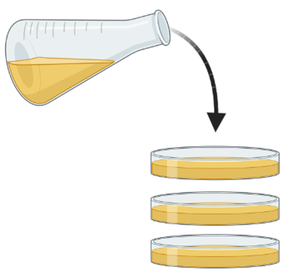
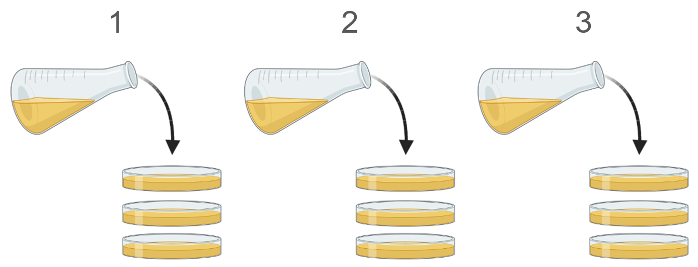

# Technical versus biological replicates

## Technical replicates

Technical replicates are when you make take than one measurement of the same sample. These repeated measurements represent the error that results from unaccounted or unknown variability in doing the experiments and/or intrinsic to the instrumentation. 

It is good to do technical replicates in your study to assess the reproducibility of the measurements you are making. However, technical replicates do not address the reproducibility of the biological effect being studied. For example, in an experiment that tests the effect of a drug on the number of bacterial colonies, one could culture three samples of the same initial liquid bacterial culture in three different plates. Each plate is a technical replicate, but the experiment has only one biological replicate because all the bacteria come from the same initial liquid culture. 

Technical replicates tell you how noisy or repeatable your measurements are. They also give you an idea of how large the magnitude of the measured effect must be to clearly be different from the variability intrinsic to the experiment itself.

<figure>
    
    <figcaption>Example of 1 biological replicate (n = 1) with 3 technical replicates because each petri dish came from the same initial bacterial culture. (Created with <a href="https://biorender.com">BioRender.com</a>)</figcaption>
</figure>

## Biological replicates

Biological replicates are when you take parallel measurements of biologically different samples. For example, doing the same experiment in different animals, plants, or bacterial cultures. These measurements are intended to represent biological variation and are necessary to assess if the effect you are studying is reproducible if other people were to repeat your experiments.

It is not only good, but necessary, to do biological replicates to answer whether the results of your experiment can be generalized. For example, doing the same measurements with independently generated bacterial cultures, water samples from different areas of a river, or different plants, and testing if you can observe similar results among the different biological samples.

<figure>
    
    <figcaption>Biological replicates that come from independent samples are necessary to evaluate biological variation. Example of 3 biological replicates (n = 3) with 9 technical replicates; 3 technical replicates for each initial bacterial culture. (Created with <a href="https://biorender.com">BioRender.com</a>)</figcaption>
</figure>

## Projects with one biological replicate

If your project consists of one biological replicate you can still publish your manuscript in JEI. Ideally, you should include additional experiments to test whether the effect you have seen is more generalizable at the biological level, however this is sometimes impossible. To go ahead and publish without doing extra experiments include the following in your manuscript:

- Clearly state in the Results section that the study consists of one biological replicate.
- If you have statistical analysis with technical replicates, clearly state in the Results that the reported statistics are a result of technical replicates and that they represent the variability in the methods, not in biological processes.
- Explain the following points in your Discussion:
  - What limitations does the study have due to the fact that it has one biological replicate?
  - What is the scope of your conclusions with an n = 1?
  - What information would you have and how might your conclusions change if you had more biological replicates?

## Additional resources
- Bell, G. Replicates and repeats. *BMC Biol* **14,** 28 (2016). https://doi.org/10.1186/s12915-016-0254-5
- Vaux DL, Fidler F, Cumming G. Replicates and repeats--what is the difference and is it significant? A brief discussion of statistics and experimental design. *EMBO Rep.*  **13,**291-296 (2012). https://doi.org/10.1038/embor.2012.36
- Blainey P, Krzywinski M & Altman N.  Replication. *Nat Methods* **11,** 879–880 (2014). https://doi.org/10.1038/nmeth.3091

---
*Created by Juan Martinez-Francois.*

*These materials are open access and distributed under the terms of the [Creative Commons Attribution license](https://creativecommons.org/licenses/by/4.0/) (CC BY 4.0), which permits unrestricted use, distribution, and reproduction in any medium, provided the original author and source are credited.*

